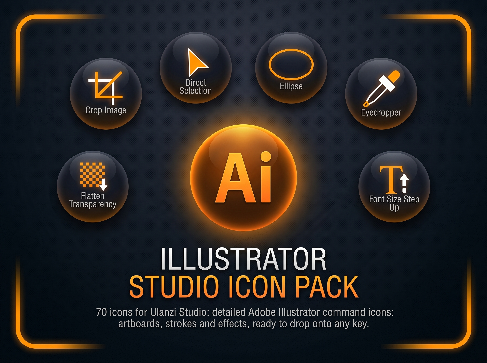

# Illustrator Studio - Icon Pack for Ulanzi Studio




A detailed, command-accurate icon pack (`.png`) designed for **Ulanzi Studio** and **Ulanzi Deck** users.

Trigger Adobe Illustrator's most-used vector tools and commands straight from your deck: artboards, paths, selections and type — without breaking focus to chase a menu.

---

## ✨ Features

- 🎨 **High Quality & Optimized**
  - Crisp PNG icons tailored for Ulanzi Deck displays.

- ✏️ **Illustrator-Accurate Design**
  - Icons that mirror Illustrator's own toolbar, menu and panel commands.

- ⚡ **Automated Installers**
  - One-click installation for:
    - **Windows** (`.bat`)
    - **macOS** (`.command`)

- 📁 **Organized Structure**
  - Automatically installs into a dedicated `Illustrator_Studio` folder inside your Ulanzi Studio icon library.

---

## 📁 Repository Structure

```text
Illustrator Studio Icon Pack/                    (repo root)
├── Illustrator Studio Icon Pack/                # Icons + manifest
│   ├── Soft_Home-042-ADOBE-ILLUSTRATOR_artboard_ulanzi.png
│   ├── Soft_Home-042-ADOBE-ILLUSTRATOR_pen_ulanzi.png
│   ├── ...                                      # 71 icons total
│   └── manifest.json
├── Illustrator_Studio_Icon_Pack.jpeg
├── instalar_icones_ulanzi.bat
├── instalar_icones_ulanzi.command
└── README.md
```

> ⚠️ The **README, banner and installer scripts must stay at the repo root**, outside the `Illustrator Studio Icon Pack/` folder. Only the icons and `manifest.json` belong inside it — that's the exact folder the installers copy from and the one Ulanzi Studio expects to import.

---

# 🚀 Installation

## 🖥️ Windows

1. Download or clone this repository.
2. Double-click **`instalar_icones_ulanzi.bat`** (at the repo root, next to the `Illustrator Studio Icon Pack` folder).
3. Restart **Ulanzi Studio**.
4. Your icons will be available under:

```
Icons → Illustrator_Studio
```

---

## 🍎 macOS

1. Download or clone this repository.
2. Open **Terminal** and make the installer executable (if needed):

```bash
chmod +x instalar_icones_ulanzi.command
```

3. Double-click **`instalar_icones_ulanzi.command`** (at the repo root, next to the `Illustrator Studio Icon Pack` folder).
4. Restart **Ulanzi Studio**.
5. Your icons will be available under:

```
Icons → Illustrator_Studio
```

---

# 🔧 Manual Installation

If you prefer to install the icons manually:

### Windows

```text
%APPDATA%\Ulanzi\UlanziDeck\Icons\Illustrator_Studio
```

### macOS

```text
~/Library/Application Support/Ulanzi/UlanziDeck/Icons/Illustrator_Studio
```

Copy everything from the inner `Illustrator Studio Icon Pack/` folder (all `.png` files + `manifest.json`) into the destination folder above.

---

# 🎛️ Icon List

**71 icons**, grouped by workflow:

| Group | Icons |
|---|---|
| **Selection Tools** | selection, direct selection, lasso, magic wand, select all, select inverse, select same appearance, select same fill and stroke, select same fill color, select same stroke color, lock selection |
| **Drawing & Shapes** | pen, paintbrush, line segment, rectangle, ellipse, create outlines, join, group, rotate, scale |
| **Artboards & Layout** | artboard, convert to artboards, show artboards, hdie artboards, fit to artboards bounds, crop marks, crop image, new layer |
| **Perspective & Guides** | perspective grid, show perspective grid, hide perspective grid, attach to active plane, release with perspective, snap to grid, show rulers, hide edges, show edges |
| **Type** | type, area type, justify all lines, left align text, right align text, font size setp up, font size setp down |
| **Color & Appearance** | color, gradient, eyedropper, new swatch, add new stroke, outline stroke, apply last effect, expand, flatten transparency, rasterize |
| **Live Paint & Slicing** | live paint make, live paint release, slice, slice make, slice release |
| **File & Project** | new, open, save, print, copy, paste, undo, keyboard shortcuts, hand |

---

# 💬 Community & Support

Found a bug or have an icon request?

- Open a GitHub **Issue**
- Share your setup with the Ulanzi community

---

# 📄 License

This project is released under the **MIT License**.

Feel free to use, modify, expand, and share it.

---

# ⭐ Support the Project

If you enjoy this icon pack, consider giving this repository a **⭐ Star** on GitHub.

It helps other Ulanzi users discover the project and supports future updates.
